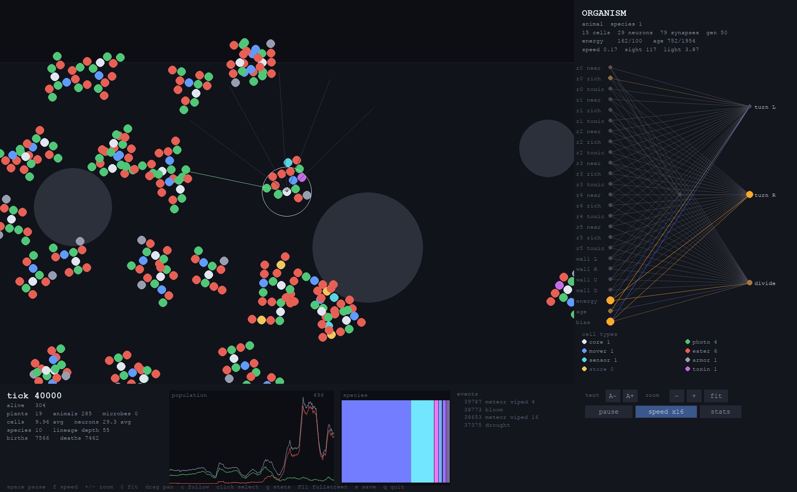

# primordial

An open-ended evolution sandbox. It starts with a dish of identical single
cells and no goal, and you watch what shows up.

There is no fitness function anywhere in this repository. Nothing is scored,
ranked or bred by the simulation. An organism has one problem — stay solvent
long enough to divide — and every structure you see on screen is something that
problem paid for.

## What is actually being simulated

Every organism has two genomes that mutate independently when it divides.

**A body.** A clump of cells on a square lattice. Every organism begins as a
single undifferentiated cell. Mutation can bolt on a cell, respecialise one, or
drop one, and the cell types decide what the organism can physically do:

| cell | what it buys |
|---|---|
| `core` | feeds weakly on ambient light; every body has exactly one |
| `photo` | photosynthesis — free energy, but it does not move |
| `mover` | speed and turning rate |
| `eater` | reach and bite strength — lets it consume other organisms |
| `sensor` | sight range |
| `armor` | reduces damage taken when bitten |
| `store` | energy capacity |
| `toxin` | hurts whatever eats it, and costs upkeep every tick |

**A brain.** A neural network evolved with NEAT (Stanley & Miikkulainen 2002),
starting from a bare input→output layer with no hidden neurons. Mutation
perturbs weights, adds connections, and splits existing connections to insert
new neurons, so depth and width are discovered rather than configured. The
network reads 24 senses and drives three outputs: left thruster, right
thruster, and the urge to divide.

### Nobody defines a plant or an animal

There is one organism type in the code. A clump that fills with `photo` cells
and never grows a `mover` **is** a plant. One that grows movers and eaters is
an animal, and it can only survive by eating things that are evolving not to be
eaten. The kingdom label in the UI is read off the body after the fact — nothing
in the simulation branches on it.

### The economy

All energy enters the world as light and every organism pays rent. A cell costs
upkeep each tick, scaled sublinearly with body mass (Kleiber's law), so large
bodies must earn their size. Photosynthesis is shaded by nearby neighbours, so
crowding starves a patch and space itself becomes contested. Movement, toxins
and division all cost. Nothing is free, which is the only reason selection has
anything to bite on.

Rocks block movement. Droughts, blooms and meteor strikes fire at random and
are logged in the UI.

## Running it

    pip install pygame numpy scipy
    python run.py

The window sizes itself to your display. Press the `speed` button a couple of
times — real change takes tens of thousands of ticks.

| control | |
|---|---|
| `space` | pause |
| `f` / speed button | cycle x1 → x4 → x16 → x64 |
| wheel, `+` / `-` | zoom |
| `0` | fit whole world |
| drag | pan |
| click | select an organism and watch its brain fire |
| `tab` | jump to the largest organism alive |
| `c` | follow the selection |
| `g` | global stats — full cell census, largest body, largest brain |
| `[` `]`, `A-` `A+` | UI text size |
| `F11` | fullscreen |
| `s` | save the selected genome to `runs/` |

## Reading the display

Organisms are drawn **cell by cell**, coloured by cell type, so what a thing is
made of is visible at a glance. Zoom in far enough and you are looking at the
actual body plan that evolution arrived at.

The brain panel draws the selected organism's network live. Orange is
excitation, blue is inhibition, node size is firing strength, and every line is
a synapse coloured by the signal currently crossing it. Neurons in the middle
columns did not exist at the start of the run — they were inserted by mutation.

## Layout

    primordial/genes.py      NEAT genome: innovations, mutation, crossover, distance
    primordial/brain.py      genome -> evaluable feedforward network
    primordial/body.py       cell-lattice body genome and its derived stats
    primordial/world.py      the dish: energy economy, senses, eating, division, weather
    primordial/evolution.py  speciation (labels and colours only)
    primordial/render.py     camera, cell rendering, brain view, stats
    primordial/app.py        the interactive loop
    run.py                   entry point

`docs/` holds the design notes and the running research log.

## Status

Working and open-ended. See [docs/ROADMAP.md](docs/ROADMAP.md) for what is next
and, more importantly, for an honest account of which parts of the long-term
goal are engineering and which are unsolved research.

MIT licensed.
